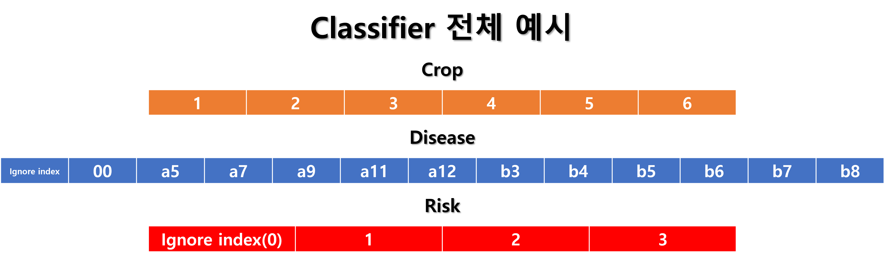
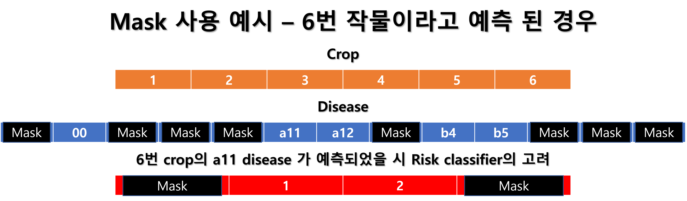

# 모델 전체 흐름도

## 모델에 대한 설명
- 현재의 예측 과제는 (crop)-(disease)-(risk)로 이루어진 결과를 단일 label로 취급하고 있음.
- 바꿔 말하면 3가지 예측 중 하나라도 틀린다면, 결과적으로 틀린 답안.
- 이는 (crop)-(disease)-(risk) 순으로 조건부 확률로 생각할 수 있음. crop에 따라 disease 양상이 결정되며, crop과 disease에 따라 결과의 risk 정도가 달라짐(4단계 모두 있는 것이 아님)
- 이렇게 과제를 바꿀 경우, 각각의 예측 성능을 최대화 하고, (crop)-(disease)-(risk) 순에 따라 예측된 결과를 추가적인 정보원으로 사용하면 예측 정확도가 더욱 높아질 수 있을 것으로 가정할 수 있음
- 특히, 이미지 분류의 관점에서 최종적으로 필요한 feature는 다를 수 있으나, 공통 분모가 매우 많을 것으로 가정할 수 있음. 이는 과제가 본질적으로 동일한 대상에서 나타날 수 있는 상태 조건들의 조건부 확률에 기반하기 때문.
- 따라서 base model과 이로부터 crop, disease, risk를 예측하는 Deep Neural Network 구조를 고안해 냄. 이는 속도 측면에서 또한 여러 개의 독립적인 모델보다 효율성이 높음
- 동시에 Catboost에서도 이전에 예측한 조건(예시: disease 예측에는 crop에 대한 정보를 투입하는 것)을 투입하는 구조를 고안함.
-----------------------------------------------------------------------------
### 실제 모델 input과 output, 훈련 방법
- Big Transfer(https://arxiv.org/pdf/1912.11370.pdf)를 단일 base model로 하여 그 base model에 이미지를 넣어서 나온 결과를 crop, disease, risk 각각의 classifier에 input으로 넣어 최종 예측을 수행.
- Catboost를 이용하여 테이블형 정형 데이터를 활용. crop과 disease를 예측. risk 예측은 f1 score가 낮아 사용 불가능(risk 점수가 3점인 경우는 전체 데이터의 약 1%. 데이터 부족 때문인지 성능이 매우 낮게 나타남).
- Deep Neural Network와 Catboost의 crop, disease 예측 결과를 앙상블하여 사용(단순 평균).   
- Deep Neural Network의 경우, 단순 합산 loss 값을 사용하면, 예측해야하는 3가지 task 중, 중요도에 따른 모델의 차별적인 훈련이 불가능 해짐. 이를 위해 몇가지 트릭을 사용.
  1. ignore index의 적극적인 사용: Crop 예측의 경우 의미없는 값이 없기에 100% 모든 데이터가 중요하나, Disease 예측의 경우, 이미 Crop 단계에서 2가지 작물은 정상군 밖에 존재하지 않는 상황. 따라서 이 작물들에 대한 Disease 예측은 전혀 필요가 없음. 마찬가지로 Disease 예측에서 정상군으로 판별되면 Risk 예측의 필요가 전혀 없음. 이런 상황에서 ignore index를 활용하면 total loss에 영향을 미치는 데이터의 비율이 crop은 100%, disease는 약 70%, risk는 약 30%로, 필요없는 정보임에도 과도하게 모델 학습에 영향을 미치게 만들 가능성을 없앨 수 있음. 단, risk의 경우 disease가 정상이면 항상 0으로 예측되어야 하기에 이를 그대로 ignore index로 사용하면 되지만, disease의 경우 '정상' 자체를 ignore index로 사용할 수 없음. 2가지 작물 군에서만 정상으로 확정지을 수 있기에, 별도의 카테고리를 예측하도록 하고, 이를 ignore index로 지정하는 방식을 사용.
  2. Mask의 사용: disease와 risk의 경우 앞선 예측의 결과에 따라 모델이 산출해 낼수 있는 전체 결과 범위보다 적은 범위 내에서만 고려하면 되게 됨. 예를 들어 작물 중, 토마토의 경우, 질병 분류가 정상과 흰가루병밖에 없으며, 질병 심각도 또한 정상과 흰가루병에서의 중기 밖에 존재하지 않음. 따라서 이전에 예측에서 얻어진 정보로 이 부분에만 예측을 제한시키도록 마스크를 이용해 결과를 제약할 수 있음.   
  3. Focal Loss(https://arxiv.org/pdf/1708.02002.pdf)의 사용: 이 loss 값은 기본적으로 예측을 잘하는 대상에 대한 loss 값을 줄임으로써 다른 빈도수가 낮고 아직 모델이 잘 예측하지 못하는 범주에 대한 loss 값을 상대적으로 크게하는 방식. 실제로 각각의 classifier loss에 기여하는 데이터의 비율이 다른 가운데, 잘 예측하는 것의 loss 값에 대한 영향력을 축소시킬 필요가 있음. 극단적인 예로는 Risk 3단계의 경우 전체 데이터의 1% 정도에 불과함. 이를 사용함으로써 얻는 효과는, 모델이 아직 학습이 덜 된 범주의 데이터에 초점을 맞추고, 실제 데이터 비율이 적더라도 이에 더욱 초점을 맞춤으로써 효과적인 학습이 가능해 질 수 있음. 예를 들자면, 결과적으로 crop 예측을 매우 잘할 경우 crop classifier의 성능 개선의 중요도는 떨어지고 다른 classifier의 성능 개선이 필요하게 되는데, 이를 자동으로 조절해주는 역할을 하게 됨.   
  4. 위의 trick을 모두 사용하더라도 과제 자체는 근본적으로 조건부 확률을 고려해야 하나, 각각의 모델이 독립적으로 학습되고 있는 상황. 비록 몇가지 트릭으로 완전한 독립적인 학습보다는 서로 영향을 주고 받는 상황이긴 하나, 각각의 classifier의 성능이 뛰어나다고 해서 결과인 (crop)-(disease)-(risk) 를 정확히 맞춘다는 보장이 없음. 따라서 validation 환경에서 이들을 다시 조합하여 전체 F1 score를 산출하여 뛰어난 결과를 낸 모델 체크포인트를 선정함.   

- 기본적으로 base model 이 crop, disease, risk 분류에 충분히 도움이 될 정보를 학습하여 산출할 것으로 기대하였으나, risk classifier의 성능은 다소 떨어져, disease에 따른 embedding을 투입. disease만 고려한 이유는 기본적으로 crop의 구조는 이미지 상에서 단독으로 충분히 변별 가능하다고 가정하였기 때문. 실제로도 성능 향상으로 이어짐.
- Catboost의 경우 hyperparameter search를 통해 최적값 모델 선정.

## 각각의 Deep Neural Network 구조

##### 구조 자체는 간단하나, mask를 직접적으로 사용하는게 가장 큰 특징
   
## Mask 사용 예시(원래 모델이 예측하는 범위 vs 실제 예측하는 범위)

## 전처리 과정
- 훈련 데이터에는 image, json, csv 파일이 주어져 있으며, 테스트 데이터에는 json이 없음
- json에는 crop, disease, risk 라벨이 주어져 있고, 사진이 찍힌 부위, 생육 단계, 실제 대상이 되는 존재의 bbox 등의 정보가 존재함.
- 훈련 셋과 검증 셋에 데이터가 고르게 분포되도록 crop, disease, risk, 사진이 찍힌 부위, 생육 단계의 5가지 정보를 기반으로 stratified sampling을 진행. 이때, 오직 2개만 존재하는 데이터가 있어 k-fold 검증은 잠정 중단. 단일한 train-validation split만 진행.   
- csv 파일에는 평균적으로 이틀에 걸친 온도, 이슬점 등의 데이터가 10분 단위로 기록되어 있음. 단, 중복 기록되거나, 일부 데이터가 누락되는 경우, 애초에 거의 대부분의 샘플에 해당 열의 데이터가 없는 경우 등을 발견.
- 대부분의 데이터에 해당 열의 데이터가 없는 경우 아예 제거. 누적일사와 CO2의 경우 존재 여부를 추가하고, 없는 경우 이와 관련된 데이터를 전부 -1로 처리(boosting 알고리즘을 사용할 예정이기에 가능한 방식)
- 논리적으로 생각했을 때, 질병의 발생 여부는 환경의 극단적인 상황에 단시간 노출되기 보다는, 일정한 한계점을 벗어난 환경에 일정 시간 이상 노출되었을 때 발생할 것으로 예측. 이에 따라 각 열의 값들에서 percentile을 구함. 총 50등분하여 전처리 수행. 이는 48시간 동안의 낮은 값부터 높은 값까지 순차적으로 나열하는 효과를 지니며, 각 값은 몇시간 동안 그 값보다 높은 수치(혹은 낮은 수치)에 작물이 노출되었는지를 대표하는 값으로 볼 수 있음. 실제, percentile 개부를 줄이면 성능이 감소됨을 확인.   
- 또한, percentile 사용의 이점은 데이터 누락이나 동일 데이터의 중복 등에 매우 강건하다는 점이 특징. 이번 데이터는 확인한 바로는 이틀간의 데이터를 항상 주었지만, 전처리 방법의 특성상, 예측시 3일 혹은 일주일간의 데이터(너무 과도하게 긴 날짜가 아니라면)가 들어왔더라도 전처리에 문제 없을 뿐만 아니라 성능 측면에서도 준수한 결과를 낼것이라 추측할 수 있음.
- Image augmentation의 경우 flip과 rotation 적용. 시간에 따른 밝기 변화도 고려하기 위해 brightness에도 변화를 줌.
- 특히, 대상 작물에 대한 bbox가 주어졌기에, 이것의 사용을 극대화 하기 위해 bbox를 항상 포함하는 random crop을 진행. 이는 대상의 크기와 위치가 다양하더라도 일반화할 가능성을 높일 것으로 예상.
- 훈련 셋과 달리 테스트 셋에서는 애초에 crop, disease에 대한 정보가 빠져있음. 이에 대한 정보는 모델이 crop, disease를 예측함에 따라 데이터셋에 추가되도록 함.

# 코드 설명
- meta_data.py : 기본 정보가 적혀 있음. 마스크 처리를 위한 것이 가장 핵심
- data_preprocessing.py : 데이터 전처리를 위함. Train과 Test 방식을 분리하였음. K-fold 방식을 구현하긴 하였으나 사용하지 않기에 주석처리함. 필요시 사용 가능.
- loss.py : Focal Loss 구현
- model.py : 실제 사용한 모델.
- train_cat.py : catboost를 훈련하기 위한 코드. grid search를 약간만 변형하면 진행할 수 있으며, 그 결과들과 feature importance 확인을 위한 부분은 주석처리되어 있음.
- train_torch.py : Deep Neural Network 모델을 훈련하기 위한 코드. Batch size의 default는 44로 약 48GB의 GPU 메모리가 필요. 다만, 훈련 속도 감소를 감수한다면 amp 적용부분을 제거하면 되고, 20%가 넘는 batch 사이즈 증가가 가능.
- predict.py : 실제 추론을 위한 코드. 위의 코드를 실행할때, default값은 전혀 손대지 않았다면 별 문제 없이 진행. 체크포인트 저장 위치 등을 바꾸었다면 그 경로를 입력해줘야 함.

